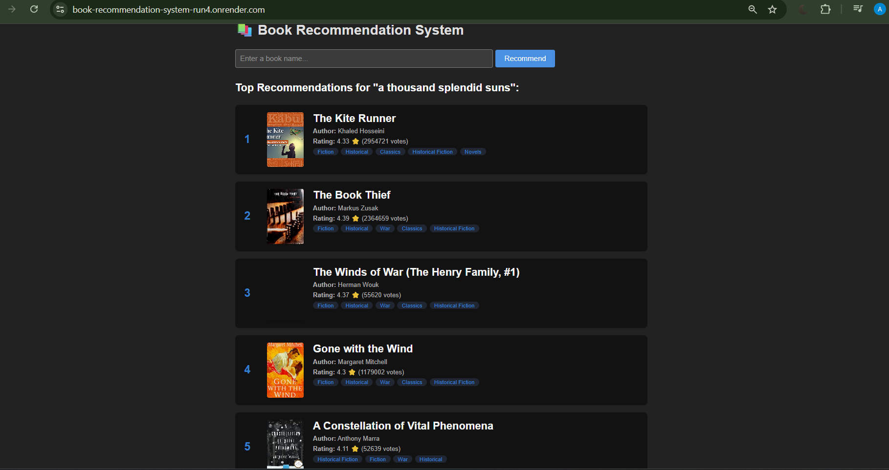

# 📚 Book Recommendation System

A content-based book recommendation system built with Python and Flask.

🔗 **Live Demo:** https://book-recommendation-system-run4.onrender.com

## How It Works
- Uses **TF-IDF vectorization** on book descriptions and genres
- Uses **Cosine Similarity** to find similar books
- Combines content similarity with genre similarity (70/30 split)
- Filters broad genres to improve recommendation quality
- Boosts important genre matches for better results

## Tech Stack
- Python
- Flask
- Scikit-learn (TF-IDF, Cosine Similarity)
- Pandas, NumPy
- Scipy (Sparse Matrices)
- Deployed on Render

## Dataset
- Goodreads dataset with 9500+ books
- Features: Title, Author, Description, Genres, Rating, Votes

## Project Structure
```
Book-Recommendation_System/
├── app.py               # Flask backend
├── notebook.ipynb       # Model training code
├── requirements.txt     # Dependencies
├── templates/
│   └── index.html       # Frontend
└── model/               # Saved models (downloaded from Google Drive)
```


## Screenshots

